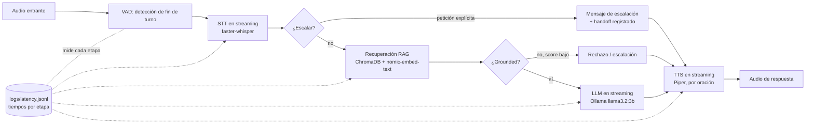

# Bot de Atención al Cliente por Voz con RAG (Dominio Financiero)

[English](README.md) | **Español**

Un bot de atención al cliente por voz para un dominio financiero — consulta
de saldos, estados de cuenta, transacciones recientes — construido para
demostrar un pipeline de voz completo y **consciente de la latencia**:
**STT → intención → RAG → LLM → TTS**, con streaming de punta a punta. Corre
completamente sobre un **stack local y gratuito** (Ollama, ChromaDB,
faster-whisper, Piper) — no requiere API keys. La demo habla **inglés y
español** (seleccionable por el usuario) e incluye tema claro/oscuro.

Este proyecto ataca las dos formas en que los bots de voz típicamente
fallan: recuperar la información equivocada (falla de RAG), y recuperar la
información correcta pero sentirse lento/robótico (falla de
latencia/streaming). Está construido para defenderse punto por punto: cada
afirmación de abajo está respaldada por la propia suite de tests del
proyecto y sus propios números medidos, no estimaciones.

## Tabla de contenidos

- [Arquitectura](#arquitectura)
- [Inicio rápido](#inicio-rápido)
- [Estructura del proyecto](#estructura-del-proyecto)
- [Metodología: BMAD + spec-kit](#metodología-bmad--spec-kit)
- [Métricas de latencia](#métricas-de-latencia)
- [Decisiones de diseño](#decisiones-de-diseño)
- [Testing](#testing)
- [Trabajo futuro](#trabajo-futuro)

## Arquitectura



Cuatro capas, con dependencias apuntando solo hacia abajo: **api**
(`app/main.py`, FastAPI REST + WebSocket) → **pipeline** (`app/pipeline/`,
orquesta las etapas — secuencial o streaming) → **etapa** (`app/rag/`,
`app/llm/`, `app/voice/`, `app/escalation.py`) → **cliente-infra** (wrappers
delgados sobre Ollama, ChromaDB, faster-whisper y Piper dentro de cada
módulo de etapa).

Las decisiones de arquitectura completas (AD-1 a AD-5) viven en
[`_bmad-output/planning-artifacts/architecture.md`](_bmad-output/planning-artifacts/architecture.md).

## Inicio rápido

Requiere [`uv`](https://docs.astral.sh/uv/) y [Ollama](https://ollama.com/)
corriendo localmente.

```bash
# 1. Descarga los modelos locales que usa el proyecto
ollama pull llama3.2:3b
ollama pull nomic-embed-text

# 2. Crea el entorno (Python 3.12 — ver Decisiones de diseño para el porqué)
uv venv --python 3.12 .venv
uv pip install -e ".[dev]" --python .venv

# 3. Descarga las voces de Piper (inglés + español)
.venv/Scripts/python -m piper.download_voices en_US-lessac-medium --download-dir data/models/piper
.venv/Scripts/python -m piper.download_voices es_MX-ald-medium --download-dir data/models/piper

# 4. Ingesta la base de conocimiento en Chroma
.venv/Scripts/python -m app.rag.ingest

# 5. Corre los tests
.venv/Scripts/python -m pytest

# 6. Corre el servidor y abre la página demo
.venv/Scripts/uvicorn app.main:app --reload
# -> http://127.0.0.1:8000/
```

La página demo (`frontend/index.html`) es una interfaz de
mantener-presionado-para-hablar: mantén el botón, haz una pregunta, suelta,
y escucha la respuesta en streaming. La prueba con micrófono en vivo es un
paso manual para hacer localmente — un agente de código automatizado no
puede otorgarse a sí mismo permiso de micrófono del navegador (ver
[Decisiones de diseño](#decisiones-de-diseño)).

## Estructura del proyecto

```text
app/
  main.py            # FastAPI: REST (/chat/text, /chat/audio) + WebSocket (/ws/voice)
  config.py            # configuración (modelos, umbrales, rutas)
  rag/                  # base de conocimiento, ingestión, recuperación (+ gate anti-alucinación)
  llm/                  # wrapper de Ollama (bloqueante + streaming), clasificador de intención
  voice/                # faster-whisper (STT), Piper (TTS), webrtcvad (VAD)
  pipeline/              # sequential.py (Fase 2) vs streaming.py (Fase 3)
  logging_utils.py     # logging de latencia por etapa (JSONL)
  escalation.py         # decisión de escalación transversal (petición explícita / sin grounding)
frontend/              # página demo push-to-talk (JS puro, sin build)
scripts/
  generate_test_audio.py   # auto-sintetiza el set de 10 preguntas de prueba vía Piper
  latency_report.py         # logs/latency.jsonl -> docs/latency/report.md + gráfica
tests/                  # una suite por fase, ver Testing abajo
specs/                  # spec-kit: un spec.md/plan.md/tasks.md por fase
_bmad-output/planning-artifacts/   # PRD.md + architecture.md de BMAD
```

## Metodología: BMAD + spec-kit

Este proyecto sigue desarrollo dirigido por especificación (SDD) en dos
etapas:

1. **[BMAD Method](https://github.com/bmad-code-org/BMAD-METHOD)** para el
   prototipado — la especificación original en español
   (`SPEC_Voice_RAG_Bot.md`) se convirtió en un PRD en inglés
   (`_bmad-output/planning-artifacts/PRD.md`) y una espina de arquitectura
   (`architecture.md`), siguiendo la disciplina PM/arquitecto de BMAD:
   requisitos funcionales numerados, decisiones arquitectónicas nombradas
   (AD-1..AD-5), non-goals explícitos y métricas de éxito.
2. **[spec-kit](https://github.com/github/spec-kit)** para la implementación
   — cada una de las cinco fases de construcción del PRD se convirtió en una
   feature de spec-kit bajo `specs/00N-*/` (una sexta,
   `006-language-and-theme`, agregó después la superficie bilingüe y el modo
   oscuro, mediante una enmienda formal a la constitution), cada una con su
   propio `spec.md` (qué/por qué, historias de usuario, criterios de
   aceptación), `plan.md` (cómo, referenciando las decisiones AD-N de la
   arquitectura), y `tasks.md` (tareas de implementación ordenadas + los
   resultados reales de los tests de esa fase). Ninguna fase empezó a
   implementarse antes de que existieran su spec/plan/tasks, y ninguna se
   consideró terminada hasta que su suite de tests dedicada pasó — ver el
   "Phase gate result" de cada `specs/00N-*/tasks.md` para lo que realmente
   ocurrió, incluyendo el hallazgo honesto (y no favorable) de latencia en
   la Fase 3. Una auditoría completa de cumplimiento SDD — con violaciones
   reales encontradas y remediadas — vive en
   [`docs/sdd-compliance-audit.md`](docs/sdd-compliance-audit.md).

## Métricas de latencia

Generadas a partir de las propias corridas de prueba del proyecto por
`scripts/latency_report.py` (fuente: `logs/latency.jsonl`; reporte completo:
[`docs/latency/report.md`](docs/latency/report.md)).

**Tamaño de muestra:** 10 peticiones secuenciales (Fase 2), 7 en streaming
(Fase 3), las 10 preguntas de prueba fijas, en esta máquina local solo-CPU.

| Pipeline | Media hasta el primer audio | Mín | Máx |
| --- | --- | --- | --- |
| Secuencial (Fase 2) | 8294ms | 2180ms | 21809ms |
| Streaming (Fase 3) | 13598ms | 10465ms | 18293ms |


**El número de titular no favorece al streaming en estos datos** — ver
[Decisiones de diseño](#decisiones-de-diseño) para el porqué, y lo que los
números aislados de abajo muestran en su lugar:

| Etapa | Duración total media | Media hasta el primer output | Reducción |
| --- | --- | --- | --- |
| LLM (primer token vs. respuesta completa) | 8734ms | 5021ms | **42.5%** |
| TTS (primer chunk de audio vs. todos) | 9293ms | 8439ms | **9.2%** |

El objetivo SM-1 era <1.5s de latencia percibida; este stack local solo-CPU
no lo alcanza (el número real se reporta de todas formas, según el propio
principio de no-fabricación del proyecto — ver el Principio III de la
Constitution en
[`.specify/memory/constitution.md`](.specify/memory/constitution.md)).

## Decisiones de diseño

**Por qué importa el streaming — la versión honesta.** La comparación de
titular de tiempo-hasta-primer-audio de arriba muestra al streaming como
*más lento*, no más rápido, en las preguntas de prueba cortas (~2 segundos)
de este proyecto. La causa raíz está diagnosticada en
`docs/latency/report.md`: el STT en streaming de este proyecto re-transcribe
periódicamente un buffer de audio creciente (faster-whisper no tiene
decodificador incremental — un trade-off documentado, ver el Complexity
Tracking de `specs/003-streaming-e2e/plan.md`), lo que aproximadamente
duplica el costo de STT en un clip corto de una sola frase. Ese costo supera
el ahorro del solapamiento LLM/TTS cuando todo el intercambio dura pocos
segundos.

Las métricas aisladas cuentan la historia real: **el primer token del LLM
llega 42.5% antes que la respuesta completa, y el primer chunk de audio TTS
está listo 9.2% antes que todos los chunks.** Esa es exactamente la
propiedad arquitectónica que el streaming debe entregar — el usuario escucha
algo antes de que el sistema termine del todo — y es real, medida y
reproducible con `python -m scripts.latency_report`. Importa más en un turno
conversacional realista de varios segundos (donde el overhead fijo de STT es
una fracción menor del tiempo total) que en las preguntas fijas cortas de
este proyecto. Reportar honestamente el número confundido de titular, en vez
de esconderlo tras una métrica más bonita, es en sí el punto: un
entrevistador que pregunte "¿por qué importa el streaming?" recibe una
respuesta real, defendible y matizada en vez de un número de marketing.

**La no-alucinación se aplica estructuralmente, no solo con prompts.**
Defensas en capas, cada una agregada después de que una falla *real* fuera
cazada por los gates de prueba, no diseñadas especulativamente:
- **Gate de score de recuperación**: `app/rag/retriever.py` devuelve un
  score de similitud con cada recuperación; `app/llm/client.py` se niega a
  llamar al LLM en modo abierto por debajo de un umbral medido (actualmente
  0.68 — recalibrado desde el 0.62 original después de que cambios en el
  texto de la base de conocimiento movieran todo el paisaje de embeddings,
  una lección aprendida a la mala: cada edición de la KB exige re-medir el
  umbral).
- **Contexto garantizado**: cuando el usuario nombra explícitamente una
  cuenta, el chunk del saldo de esa cuenta siempre se incluye en el contexto
  del LLM — una formulación degradada llegó a rankear cuatro FAQs por encima
  y el modelo fabricó un saldo ("$1,200") de la nada.
- **Guardia de cifras por oración**: cada número de una oración generada
  debe existir en el contexto recuperado, verificado *antes* de sintetizar
  el audio de esa oración — en un bot de voz, una cifra fabricada jamás debe
  pronunciarse.
- Más los arreglos anteriores que siguen vigentes: chunks de transacciones
  agregados por cuenta, decodificación greedy con `temperature=0`, y
  secciones de contexto etiquetadas por tipo (al LLM se le cazó una vez
  sumando un depósito visible a un saldo ya final y reportando un total
  equivocado).

**El modo español es inglés-interno por diseño.** La recuperación
cross-lingüe directa midió 0.47-0.54 en consultas españolas dentro de
dominio — indistinguible de fuera-de-dominio — así que la voz en español se
transcribe nativamente (confiable) y se traduce al inglés *como texto* con
el LLM local para la recuperación; la respuesta se genera después en español
y se pronuncia con una voz Piper es_MX. El modo translate integrado de
Whisper se probó primero y se abandonó con evidencia: producía traducciones
distintas y degradadas del mismo audio entre corridas ("saldo" →
save/sale/fate). Ver el Complexity Tracking de
`specs/006-language-and-theme/plan.md`.

**La escalación es deliberadamente más estrecha que la redacción original
del PRD.** `app/escalation.py` escala ante recuperación sin grounding o
petición explícita de humano. El PRD originalmente también proponía escalar
por baja confianza de clasificación de intención; construirlo y probarlo
mostró que arriesgaba bloquear respuestas correctas y bien fundamentadas por
una ambigüedad de categorización que nada tenía que ver con si el sistema
realmente sabía la respuesta. La confianza de intención se sigue
clasificando y está disponible para observabilidad (`app/llm/intent.py`) —
solo que no es un tercer disparador silencioso de escalación. Ver los
Assumptions de `specs/004-fallback-escalation/spec.md` para el razonamiento
completo.

**Local-first por defecto, agnóstico de proveedor por diseño.** Cada llamada
a modelo pasa por un wrapper delgado (`app/llm/client.py`,
`app/voice/stt.py`, `app/voice/tts.py`) — ningún otro módulo importa un SDK
de proveedor de IA directamente. Cambiar a OpenAI/ElevenLabs/Deepgram/
Pinecone después es un cambio de wrapper, no un rediseño (ver Trabajo
futuro).

**Dos pins específicos del entorno, documentados en vez de escondidos.**
`av==13.1.0` está fijado porque builds más nuevos incluyen una DLL de
enumeración de dispositivos bloqueada por la política de Application Control
de Windows de esta máquina. `setuptools<81` está fijado porque 81+ eliminó
`pkg_resources`, que `webrtcvad` todavía importa al cargar. Ambos están
comentados en `pyproject.toml` y en la tabla Stack de `architecture.md`.

## Testing

```bash
pytest                                    # suite completa
pytest tests/test_rag_qa.py -v            # Fase 1: gate de corrección RAG de 10 preguntas
pytest tests/test_pipeline_sequential.py -v   # Fase 2: STT/TTS secuencial
pytest tests/test_pipeline_streaming.py -v    # Fase 3: pipeline en streaming
pytest tests/test_escalation.py -v            # Fase 4: fallback/escalación
pytest tests/test_language.py -v              # Feature 006: modo español + guardia de turno fantasma
python -m scripts.latency_report          # regenera docs/latency/report.md + gráfica
```

El resultado real de aprobado/fallido de cada fase (no solo "debería
pasar") está registrado en el `specs/00N-*/tasks.md` de esa fase bajo
"Phase gate result", incluyendo dónde las cosas no funcionaron al primer
intento.

## Trabajo futuro

Explícitamente fuera del alcance de esta v1 (ver
`_bmad-output/planning-artifacts/PRD.md` §5 Non-Goals), documentado en vez
de silenciosamente ausente:

- **Integración telefónica real** (Twilio o equivalente) — sería un nuevo
  adaptador en la capa `api` delante de la capa `pipeline` existente; el
  contrato WebSocket `/ws/voice` ya habla en la forma correcta (frames de
  audio entrando, eventos en streaming saliendo).
- **Proveedores hosted** (OpenAI/ElevenLabs/Deepgram/Pinecone) como
  alternativas intercambiables al stack local — los límites de wrapper de
  `app/llm`, `app/voice`, `app/rag` (AD-1) están diseñados para que esto sea
  un cambio de wrapper, no un rediseño del pipeline.
- **Más idiomas además de inglés/español** — el non-goal de v1 de soporte
  multi-idioma se enmendó después (constitution v1.1.0) y inglés/español se
  entregó como `specs/006-language-and-theme`; idiomas adicionales seguirían
  el mismo patrón (transcripción nativa + traducción de texto por LLM + una
  voz Piper por idioma).
- **STT verdaderamente incremental/streaming** — faster-whisper no tiene
  decodificador incremental; un enfoque estilo whisper.cpp-streaming o Vosk
  evitaría el overhead de re-transcripción periódica que documenta la
  sección de Decisiones de diseño.
- **Síntesis TTS concurrente (no solo intercalada)** — actualmente, la
  síntesis TTS de una oración completada bloquea la siguiente petición de
  token del LLM en el mismo hilo (ver la nota de duración por etapa de
  `docs/latency/report.md`). Correr TTS en una tarea/hilo de fondo mientras
  la generación del LLM continúa reduciría más el tiempo total.
- **AudioWorklet en vez de ScriptProcessorNode** en `frontend/app.js` — la
  página demo usa la API `ScriptProcessorNode`, más simple pero deprecada,
  para evitar un archivo de módulo worklet aparte; un frontend de producción
  debería migrar.
- **Autenticación real y datos reales de clientes** — este proyecto usa una
  sola cuenta demo sintética (`app/rag/knowledge_base/account_data.json`);
  sin auth real, sin datos financieros reales, por diseño.
