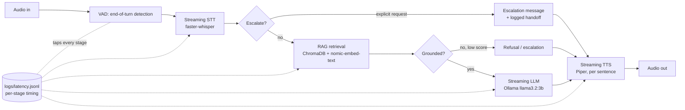
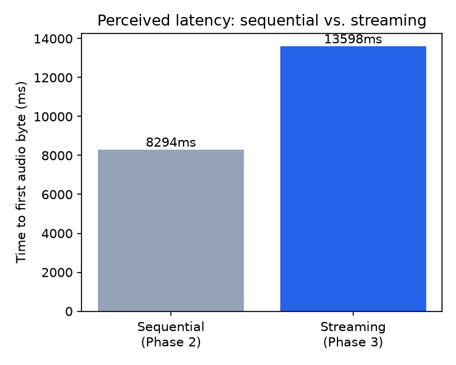

# Voice-RAG Customer Service Bot (Financial Domain)

A voice-driven customer service bot for a financial domain — balance
inquiries, statements, recent transactions — built to demonstrate a complete,
**latency-aware** voice pipeline: **STT → intent → RAG → LLM → TTS**,
streaming end-to-end. Runs entirely on a **local, free stack** (Ollama,
ChromaDB, faster-whisper, Piper) — no API keys required.

This project attacks the two ways voice bots typically fail: retrieving the
wrong information (a RAG failure), and retrieving the right information but
feeling slow/robotic (a latency/streaming failure). It's built to be
defended point-by-point: every claim below is backed by this project's own
test suite and its own measured numbers, not estimates.

## Table of contents

- [Architecture](#architecture)
- [Quick start](#quick-start)
- [Project structure](#project-structure)
- [Methodology: BMAD + spec-kit](#methodology-bmad--spec-kit)
- [Latency metrics](#latency-metrics)
- [Design decisions](#design-decisions)
- [Testing](#testing)
- [Future work](#future-work)

## Architecture



Four layers, dependencies pointing only downward: **api** (`app/main.py`,
FastAPI REST + WebSocket) → **pipeline** (`app/pipeline/`, orchestrates
stages — sequential or streaming) → **stage** (`app/rag/`, `app/llm/`,
`app/voice/`, `app/escalation.py`) → **infra-client** (thin wrappers around
Ollama, ChromaDB, faster-whisper, Piper inside each stage module).

Full architecture decisions (AD-1 through AD-5) live in
[`_bmad-output/planning-artifacts/architecture.md`](_bmad-output/planning-artifacts/architecture.md).

## Quick start

Requires [`uv`](https://docs.astral.sh/uv/) and [Ollama](https://ollama.com/)
running locally.

```bash
# 1. Pull the local models this project uses
ollama pull llama3.2:3b
ollama pull nomic-embed-text

# 2. Create the environment (Python 3.12 — see Design Decisions for why)
uv venv --python 3.12 .venv
uv pip install -e ".[dev]" --python .venv

# 3. Download the Piper voice
.venv/Scripts/python -m piper.download_voices en_US-lessac-medium --download-dir data/models/piper

# 4. Ingest the knowledge base into Chroma
.venv/Scripts/python -m app.rag.ingest

# 5. Run the tests
.venv/Scripts/python -m pytest

# 6. Run the server and open the demo page
.venv/Scripts/uvicorn app.main:app --reload
# -> http://127.0.0.1:8000/
```

The demo page (`frontend/index.html`) is a push-to-talk UI: hold the button,
ask a question, release, and listen to the streamed response. Live
microphone testing is a manual step for you to try locally — an automated
coding agent can't grant itself browser microphone permission (see
[Design Decisions](#design-decisions)).

## Project structure

```text
app/
  main.py            # FastAPI: REST (/chat/text, /chat/audio) + WebSocket (/ws/voice)
  config.py            # settings (models, thresholds, paths)
  rag/                  # knowledge base, ingestion, retrieval (+ no-hallucination gate)
  llm/                  # Ollama wrapper (blocking + streaming), intent classifier
  voice/                # faster-whisper (STT), Piper (TTS), webrtcvad (VAD)
  pipeline/              # sequential.py (Phase 2) vs streaming.py (Phase 3)
  logging_utils.py     # per-stage latency logging (JSONL)
  escalation.py         # cross-cutting escalation decision (explicit request / ungrounded)
frontend/              # push-to-talk demo page (vanilla JS, no build step)
scripts/
  generate_test_audio.py   # self-synthesizes the 10-question test set via Piper
  latency_report.py         # logs/latency.jsonl -> docs/latency/report.md + chart
tests/                  # one suite per phase, see Testing below
specs/                  # spec-kit: one spec.md/plan.md/tasks.md per phase
_bmad-output/planning-artifacts/   # BMAD PRD.md + architecture.md
```

## Methodology: BMAD + spec-kit

This project follows spec-driven development in two stages:

1. **[BMAD Method](https://github.com/bmad-code-org/BMAD-METHOD)** for
   prototyping — the original Spanish spec (`SPEC_Voice_RAG_Bot.md`) was
   turned into an English PRD (`_bmad-output/planning-artifacts/PRD.md`) and
   architecture spine (`architecture.md`), following BMAD's PM/architect
   discipline: numbered functional requirements, named architectural
   decisions (AD-1..AD-5), explicit non-goals and success metrics.
2. **[spec-kit](https://github.com/github/spec-kit)** for implementation —
   the PRD's five build phases each became a spec-kit feature under
   `specs/00N-*/`, each with its own `spec.md` (what/why, user stories,
   acceptance criteria), `plan.md` (how, referencing the architecture's
   AD-N decisions), and `tasks.md` (ordered implementation tasks + the
   phase's actual test results). No phase's implementation started before
   its spec/plan/tasks existed, and no phase was considered done until its
   dedicated test suite passed — see each `specs/00N-*/tasks.md` "Phase gate
   result" for what actually happened, including the honest, non-clean
   latency finding in Phase 3.

## Latency metrics

Generated from this project's own test runs by `scripts/latency_report.py`
(source: `logs/latency.jsonl`; full report:
[`docs/latency/report.md`](docs/latency/report.md)).

**Sample size:** 10 sequential (Phase 2) requests, 7 streaming (Phase 3)
requests, all 10 fixed test questions, on this CPU-only local machine.

| Pipeline | Mean time-to-first-audio | Min | Max |
| --- | --- | --- | --- |
| Sequential (Phase 2) | 8294ms | 2180ms | 21809ms |
| Streaming (Phase 3) | 13598ms | 10465ms | 18293ms |



**The top-line number does not favor streaming on this data** — see
[Design Decisions](#design-decisions) for why, and what the isolated numbers
below show instead:

| Stage | Mean full duration | Mean time-to-first-output | Reduction |
| --- | --- | --- | --- |
| LLM (first token vs. full answer) | 8734ms | 5021ms | **42.5%** |
| TTS (first audio chunk vs. all chunks) | 9293ms | 8439ms | **9.2%** |

SM-1 target was <1.5s perceived latency; this local CPU-only stack does not
hit it (real number reported regardless, per the project's own no-fabrication
principle — see Constitution Principle III in
[`.specify/memory/constitution.md`](.specify/memory/constitution.md)).

## Design decisions

**Why streaming matters — the honest version.** The top-line
time-to-first-audio comparison above shows streaming as *slower*, not
faster, on this project's short (~2 second) test questions. The root cause
is diagnosed in `docs/latency/report.md`: this project's streaming STT
re-transcribes a growing audio buffer periodically (faster-whisper has no
incremental decoder — a documented trade-off, see
`specs/003-streaming-e2e/plan.md`'s Complexity Tracking), which roughly
doubles STT cost on a short single-utterance clip. That cost outweighs the
LLM/TTS overlap savings when the whole exchange is only a few seconds long.

The isolated metrics tell the real story: **the first LLM token arrives
42.5% sooner than the complete answer, and the first TTS audio chunk is
ready 9.2% sooner than all chunks.** That is exactly the architectural
property streaming is supposed to deliver — the user hears something before
the system is fully done — and it's real, measured, and reproducible with
`python -m scripts.latency_report`. It matters more in a realistic
multi-second conversational turn (where the fixed STT overhead is a smaller
fraction of total time) than on this project's short fixed test questions.
Reporting the confounded top-line number honestly, instead of hiding it
behind a cleaner-looking metric, is itself the point: an interviewer asking
"why does streaming matter?" gets a real, defensible, nuanced answer instead
of a marketing number.

**No hallucination is enforced structurally, not just by prompting.**
`app/rag/retriever.py` returns a similarity score with every retrieval;
`app/llm/client.py` refuses to call the LLM in open-ended mode when that
score is below a tuned threshold (0.62, empirically separating in-domain
scores of 0.696-0.901 from out-of-domain scores of 0.511-0.562 on this
project's knowledge base). During development, the LLM was still caught
doing unwanted arithmetic — stating a balance, then "helpfully" adding a
visible transaction amount to it and reporting a wrong total. Fixed with
three changes, all still in the code and comments where they matter:
dropping per-transaction chunks in favor of one aggregated per-account
summary (`app/rag/ingest.py`), `temperature=0` greedy decoding for factual
QA (`app/llm/client.py`), and grouping retrieved context into labeled
sections by type instead of one flat blob. This is exactly the kind of
failure a fixed 10-question test set can miss — it happened during ad hoc
manual testing beyond the test suite, which is why the SPEC's own
non-hallucination requirement is enforced at the retrieval-gate level, not
just hoped for from prompting.

**Escalation is deliberately narrower than the original PRD wording.**
`app/escalation.py` escalates on ungrounded retrieval or an explicit human
request. The PRD originally also proposed escalating on low intent-
classification confidence; building and testing that showed it risked
blocking correct, well-grounded answers over a categorization ambiguity that
had nothing to do with whether the system actually knew the answer. Intent
confidence is still classified and available for observability
(`app/llm/intent.py`) — it just isn't a silent third escalation trigger. See
`specs/004-fallback-escalation/spec.md`'s Assumptions for the full
reasoning.

**Local-first by default, provider-agnostic by design.** Every model call
goes through a thin wrapper (`app/llm/client.py`, `app/voice/stt.py`,
`app/voice/tts.py`) — no other module imports an AI provider SDK directly.
Swapping in OpenAI/ElevenLabs/Deepgram/Pinecone later is a wrapper change,
not a redesign (see Future Work).

**Two environment-specific pins, documented rather than hidden.** `av==13.1.0`
is pinned because newer builds ship a device-enumeration DLL blocked by this
machine's Windows Application Control policy. `setuptools<81` is pinned
because 81+ dropped `pkg_resources`, which `webrtcvad` still imports at
import time. Both are commented in `pyproject.toml` and
`architecture.md`'s Stack table.

## Testing

```bash
pytest                                    # full suite
pytest tests/test_rag_qa.py -v            # Phase 1: 10-question RAG correctness gate
pytest tests/test_pipeline_sequential.py -v   # Phase 2: STT/TTS sequential
pytest tests/test_pipeline_streaming.py -v    # Phase 3: streaming pipeline
pytest tests/test_escalation.py -v            # Phase 4: fallback/escalation
python -m scripts.latency_report          # regenerate docs/latency/report.md + chart
```

Every phase's actual pass/fail result (not just "should pass") is recorded
in that phase's `specs/00N-*/tasks.md` under "Phase gate result," including
where things didn't work on the first try.

## Future work

Explicitly out of scope for this v1 (see `_bmad-output/planning-artifacts/PRD.md`
§5 Non-Goals), documented rather than silently absent:

- **Real telephony integration** (Twilio or equivalent) — would sit as a new
  `api`-layer adapter in front of the existing `pipeline` layer; the
  WebSocket contract `/ws/voice` already speaks in the right shape
  (audio frames in, streamed events out).
- **Hosted providers** (OpenAI/ElevenLabs/Deepgram/Pinecone) as swap-in
  alternatives to the local stack — the `app/llm`, `app/voice`, `app/rag`
  wrapper boundaries (AD-1) are designed so this is a wrapper change, not a
  pipeline redesign.
- **Multi-language support** — English only in v1, end to end (STT model,
  TTS voice, knowledge base, UI copy).
- **True incremental/streaming STT** — faster-whisper has no incremental
  decoder; a whisper.cpp-streaming-style or Vosk-based approach would avoid
  the periodic-re-transcription overhead this README's Design Decisions
  section documents.
- **Concurrent (not just interleaved) TTS synthesis** — currently, TTS
  synthesis for a completed sentence blocks the next LLM token request on
  the same thread (see `docs/latency/report.md`'s per-stage duration note).
  Running TTS in a background task/thread while LLM generation continues
  would reduce total wall-clock time further.
- **AudioWorklet instead of ScriptProcessorNode** in `frontend/app.js` — the
  demo page uses the simpler, deprecated `ScriptProcessorNode` API to avoid
  a separate worklet module file; a production frontend should migrate.
- **Real authentication and real customer data** — this project uses one
  synthetic demo account (`app/rag/knowledge_base/account_data.json`); no
  real auth, no real financial data, by design.
