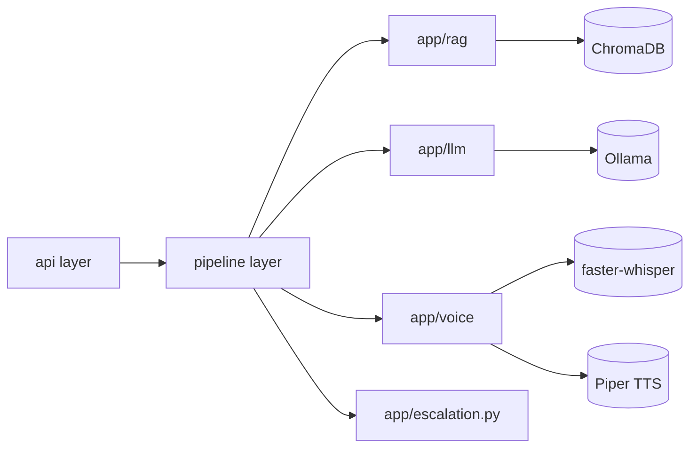

# Architecture Spine — Voice-RAG Customer Service Bot

## Design Paradigm

Pipes-and-filters: each pipeline stage (STT → intent → retrieval → LLM → TTS)
is a pure filter — takes typed input, returns typed output, emits its own
timing — connected by a thin orchestrator that differs only in whether it
blocks (`sequential.py`) or streams (`streaming.py`).

Four layers, top to bottom, dependencies only point downward:

- **api** (`app/main.py`) — FastAPI REST + WebSocket routes; owns no business
  logic.
- **pipeline** (`app/pipeline/`) — orchestrates stages into the Phase 2
  (sequential) and Phase 3 (streaming) request flows.
- **stage** (`app/rag/`, `app/llm/`, `app/voice/`, `app/escalation.py`) — the
  filters themselves: retrieval, intent classification, answer generation,
  STT, TTS, VAD, escalation decision.
- **infra-client** (inside each stage module) — thin wrappers around Ollama,
  ChromaDB, faster-whisper, and Piper; the only code allowed to talk to a
  local model runtime.

## Invariants & Rules

### AD-1 — Local-only inference by default

- **Binds:** all
- **Prevents:** a stage silently depending on a hosted API key at runtime.
- **Rule:** every model call goes through `app/llm/client.py` (Ollama) or
  `app/voice/{stt,tts}.py` (faster-whisper, Piper). No other module imports an
  AI provider SDK directly. Hosted-provider swaps (documented, not built —
  PRD §6.2) must land behind these same interfaces.

### AD-2 — Stage boundary is the latency-log boundary

- **Binds:** FR-7, everything under `app/pipeline/`
- **Prevents:** a stage that runs untimed and invisible to the Phase 5 report.
- **Rule:** every pipeline stage call is wrapped by
  `app/logging_utils.py::stage_timer`, which appends one JSONL record per
  stage per request (`request_id`, `stage`, `start_ts`, `end_ts`,
  `first_partial_ts` where applicable — e.g. first LLM token, first TTS audio
  byte). No stage may bypass this wrapper.

### AD-3 — Sequential and streaming pipelines share stage modules

- **Binds:** `app/pipeline/sequential.py`, `app/pipeline/streaming.py`
- **Prevents:** the Phase 3 before/after comparison measuring two different
  implementations instead of one architectural change.
- **Rule:** both pipelines call the exact same `app/rag`, `app/llm`,
  `app/voice` functions. Only orchestration differs: `sequential.py` awaits
  each stage fully before calling the next; `streaming.py` consumes
  async-generator variants of the same underlying stage functions
  (token-by-token LLM, chunk-by-chunk TTS) and forwards partial results over
  the WebSocket as they arrive.

### AD-4 — No-hallucination gate

- **Binds:** FR-3, FR-4, `app/rag/retriever.py`, `app/llm/client.py`
- **Prevents:** the LLM answering confidently from outside the Knowledge Base.
- **Rule:** `retriever.py` returns a similarity score alongside retrieved
  passages. If the top score is below `RETRIEVAL_MIN_SCORE` (configured), the
  LLM prompt is forced down a fixed "insufficient context" branch that returns
  a documented refusal string — it is never given the freedom to generate an
  open-ended answer without grounding.

### AD-5 — Escalation is cross-cutting, not per-pipeline logic

- **Binds:** FR-6, both pipelines
- **Prevents:** duplicated/divergent escalation logic between sequential and
  streaming code paths.
- **Rule:** `app/escalation.py::should_escalate(intent_result,
  retrieval_result, transcript)` is the single decision point, called by both
  pipelines after intent classification and retrieval. Pipelines only render
  its decision (message + log event); they never re-implement the threshold
  check.



## Consistency Conventions

| Concern | Convention |
| --- | --- |
| Naming (entities, files, interfaces, events) | Python: `snake_case` modules/functions, `PascalCase` classes. spec-kit feature dirs: `NNN-kebab-case-name`. Pipeline stage names in logs: `stt`, `intent`, `retrieval`, `llm`, `tts` (fixed vocabulary, never renamed per-call). |
| Data & formats (ids, dates, error shapes, envelopes) | Timestamps: UTC epoch seconds (float, `time.monotonic()` for deltas, `time.time()` for wall clock) — never naive local time. Logs: JSON Lines, one object per request in `logs/latency.jsonl`. `request_id`: UUID4 string, generated once per user turn and threaded through every stage. |
| State & cross-cutting (mutation, errors, logging, config, auth) | Config via `pydantic-settings` reading `.env` / `.env.example` defaults (`app/config.py`). All user-facing and log strings in English (project-wide constraint). No auth in v1 (PRD §5 Non-Goals) — single synthetic demo account, no session/user model. |

## Stack

| Name | Version |
| --- | --- |
| Python | 3.12.12 (via `uv venv`; system default 3.14 avoided — ML wheel compatibility) |
| FastAPI | >=0.115 |
| uvicorn[standard] | >=0.32 |
| ChromaDB | >=0.5.20 (persistent client, `data/chroma/`) |
| Ollama (LLM) | `llama3.2:3b` default (latency-first), `qwen3.5:9b` documented alternative |
| Ollama (embeddings) | `nomic-embed-text` |
| faster-whisper | >=1.1.0, model `base.en` |
| PyAV (`av`) | ==13.1.0 pinned — newer builds ship a device-enumeration DLL blocked by this machine's Windows Application Control policy |
| piper-tts | >=1.2.0, voice `en_US-lessac-medium` |
| webrtcvad | >=2.0.10 |
| setuptools | <81 pinned — 81+ dropped `pkg_resources`, which `webrtcvad` still imports |
| pytest / pytest-asyncio | >=8.3 / >=0.24 |
| matplotlib | >=3.9 (Phase 5 latency chart) |

## Structural Seed

```text
app/
  main.py            # FastAPI: REST text endpoint + WebSocket voice endpoint
  config.py           # pydantic-settings
  rag/
    ingest.py          # embeds knowledge_base/ into Chroma
    retriever.py        # similarity search + score gate (AD-4)
    knowledge_base/     # FAQs + simulated account data (English, synthetic)
  llm/
    client.py           # Ollama wrapper: blocking + streaming generate()
    intent.py            # intent classification prompt (FR-2)
  voice/
    stt.py               # faster-whisper wrapper: file + streaming-chunk transcribe
    tts.py                # Piper wrapper: full + sentence-chunk synthesize
    vad.py                # webrtcvad end-of-turn detection (FR-1, NFR-3)
  pipeline/
    sequential.py         # Phase 2: blocking stage-by-stage orchestration
    streaming.py           # Phase 3: async-generator streaming orchestration
  logging_utils.py     # stage_timer (AD-2), JSONL writer
  escalation.py         # should_escalate() (AD-5)
frontend/
  index.html, app.js, styles.css   # mic capture demo page (WebRTC/MediaRecorder)
tests/
  test_rag_qa.py, test_pipeline_sequential.py, test_pipeline_streaming.py,
  test_escalation.py, fixtures/
scripts/
  generate_test_audio.py   # Piper self-synthesizes the 10 test questions
  latency_report.py         # JSONL -> before/after report + chart (Phase 5)
specs/
  001-rag-base/ 002-stt-tts-sequential/ 003-streaming-e2e/
  004-fallback-escalation/ 005-docs-metrics/    # spec-kit spec.md/plan.md/tasks.md
```

## Capability → Architecture Map

| Capability / Area | Lives in | Governed by |
| --- | --- | --- |
| FR-1 Streaming STT | `app/voice/stt.py`, `app/voice/vad.py` | AD-2, AD-3 |
| FR-2 Intent classification | `app/llm/intent.py` | AD-1 |
| FR-3 RAG retrieval | `app/rag/retriever.py`, `app/rag/ingest.py` | AD-4 |
| FR-4 Grounded streaming generation | `app/llm/client.py` | AD-1, AD-4 |
| FR-5 Streaming TTS | `app/voice/tts.py` | AD-1, AD-3 |
| FR-6 Escalation | `app/escalation.py` | AD-5 |
| FR-7 Latency logging | `app/logging_utils.py`, `scripts/latency_report.py` | AD-2 |

## Deferred

- Hosted-provider adapters (OpenAI/ElevenLabs/Deepgram/Pinecone) behind the
  same `app/llm` / `app/voice` / `app/rag` interfaces — deferred until a real
  need arises (PRD §6.2); the layer boundaries in AD-1 are designed so this is
  a swap, not a rewrite.
- Real telephony integration (Twilio or equivalent) — out of scope for v1
  (PRD §5); would sit in a new `api` adapter in front of the same pipeline
  layer.
- Multi-language support — deferred; would touch `app/voice` (model selection)
  and the knowledge base, not the pipeline shape.
- Authentication / multi-account model — deferred; v1 has exactly one
  synthetic demo account, no session boundary to design around yet.
